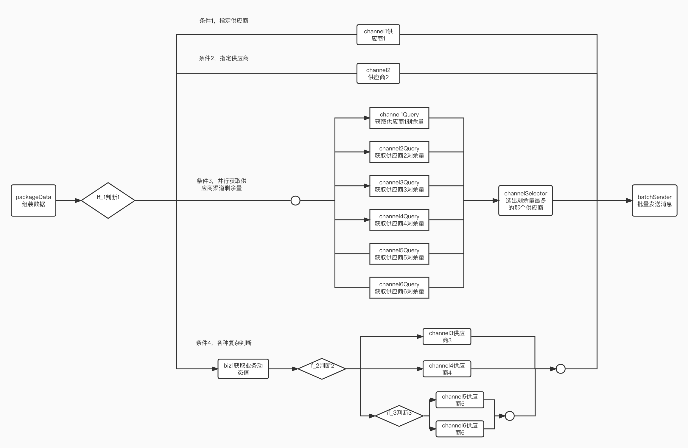
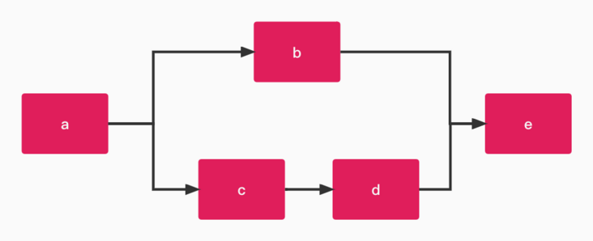
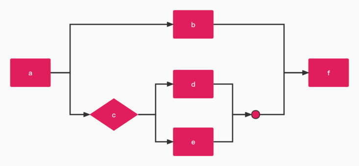
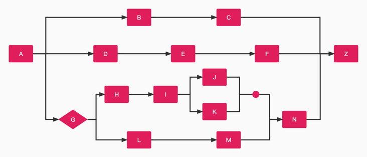

# [用LiteFlow写出个灵活的系统竟然可以如此简单！小白也能写出高级的Java业务！](https://segmentfault.com/a/1190000042084710)

## 一

最近正好公司里有个需求，一个短信业务接了多个第三方供应商，某些业务需要查询第三方供应商剩余的短信包数量去选择剩余量最多的渠道去批量发送。有些业务是指定了某个短信供应商，有些场景需要根据业务的值去动态判断该用哪个供应商。场景非常复杂，还经常变化。

以前的代码实在惨不忍睹，选择剩余量最多的渠道是一个个去查的，然后获得结果去比较。至于指定的供应商和根据业务的值去判断选择供应商则是用大量的if else去嵌套各种判断。每次看到这坨代码真的觉得太粗糙了。关键是有些供应商还经常变，新接的供应商需要替代旧的供应商，加入这一大坨代码里。业务的判断条件还时不时变化一下。

出了几次问题之后，领导看不下去了，叫我想办法去优化。

我理了理逻辑，整个关系图应该是这样的，其中我把一个个去查的变成了并行去查，为了节约串行去查的IO耗时问题。



其中有些复杂查库逻辑，判断幂等性的步骤我就去掉了。只挑选了关键的步骤画上去。

叫我去重构这个慢慢写也能写出，但是关键的是，每个步骤和判断逻辑还时不时变化下。这就要求我的代码非常灵活。所以在设计时，一直很苦恼该如何去设计。

## 二

在小组开交流会的时候，有其他组的小伙伴和我安装了一个开源框架-**LiteFlow**。

经过研究这款开源框架，发现LiteFlow是一个国产规则引擎，能够编排任意复杂的流程，还支持热刷新。这基本上完全契合我的需求啊！

文档很详细，很NICE，大概看了半天就全部学完了。发现新版本的LiteFlow的规则是用EL表达式来写的。语法总共数下来也就10个左右，非常好理解。

比如这种图：



在LiteFlow用规则表示就是：

```xml
<flow>
   <chain name="chain1">
       THEN(
           a,
           WHEN(b, THEN(c, d)),
           e
       );
    </chain>
</flow>
```

其中`THEN`是代表串行，`WHEN`代表并行执行，这种语法，一看就很好理解。

再来看这个图：



在LiteFlow里规则表示就是：

```xml
<flow>
  <chain name="chain1">
     THEN(
        a,
        WHEN(b, SWITCH(c).to(d, e)),
        f 
      );
  </chain>
</flow>
```

其中`SWITCH`关键字就是排他网关的意思，c这个组件是一个java类，根据执行的结果去选择到底应该执行`d`还是`e`。

所以这样嵌套多层也应该是毫无问题的。

LiteFlow的文档里作者给出了很详细的例子，还有一些复杂例子，比如：

LiteFlow的文档里作者给出了很详细的例子，还有一些复杂例子，比如：



这种复杂的例子用LiteFlow的表达式可以写成：

```xml
<chain name="chain1">
    THEN(
        A,
        WHEN(
            THEN(B, C),
            THEN(D, E, F),
            THEN(
                SWITCH(G).to(
                    THEN(H, I, WHEN(J, K)).id("t1"),
                    THEN(L, M).id("t2")
                ),
                N
            )
        ),
        Z
    )
</chain>
```

它的表达式还可以进行定义子变量，上述表达式又可以写成：

```xml
<chain name="chain1">
    item1 = THEN(B, C);
    item2 = THEN(D, E, F);
    item3_1 = THEN(H, I, WHEN(J, K)).id("t1");
    item3_2 = THEN(L, M).id("t2");
    item3 = THEN(SWITCH(G).to(item3_1, item3_2), N);
    
    THEN(
        A,
        WHEN(item1, item2, item3),
        Z
    );
</chain>
```

其实对照图，仔细看，会觉得这种表达式还是很清晰的。运用到我那个短信系统里是绰绰有余的。

## 三

我研究了下，花了10分钟时间，就写出了我那个流程的表达式规则：

```xml
<?xml version="1.0" encoding="UTF-8"?>
<flow>
    <chain name="channelSenderChain">
        selectBestChannel = THEN(
                                WHEN(
                                    channel1Query, channel2Query, channel3Query,
                                    channel4Query, channel5Query, channel6Query
                                ),
                                channelSelector
                            ).id("branch1");

        selectBizChannel = THEN(
                                biz1,
                                SWITCH(if_2).to(
                                    channel3,
                                    channel4,
                                    SWITCH(if_3).to(channel5, channel6).id("s3")
                                ).id("s2")
                            ).id("branch2");

        THEN(
            packageData,
            SWITCH(if_1).to(
                channel1,
                channel2,
                selectBestChannel,
                selectBizChannel
            ),
            batchSender
        );
    </chain>
</flow>
```

我用了文档中提到的子变量的方式去写，这种写法更加清晰。其实我总结了一个小窍门就是：**再复杂的图，都可以拆分成一个个局部的整体，先定局部的小变量，然后在主要的流程里去引入这些局部变量就可以了。**反正我写这个图的流程就差不多10分钟。

至于一个个小组件。我就跟着文档里做了一遍，把原来的大逻辑改拆成一个个的小逻辑。封装在不同的组件里，给上相应的Id就可以了。

最后通过`LiteflowExecutor`触发下就可以了。

```java
LiteflowResponse response = flowExecutor.execute2Resp(
    "channelSenderChain", null, BatchMessageResultContext.class);

if (response.isSuccess()) {
  BatchMessageResultContext context = response.getFirstContextBean();  
  log.info("执行成功，最终选择的渠道是{}", context.getFinalResultChannel());
} else {
  log.error("执行失败", response.getCause());
}
```

非常简单有木有！！！

而且特别优雅！！！

## 四

我改成上面这种形式了之后，每一个小逻辑块之间就完全解耦了。当中数据的连接完全是靠`上下文`进行连接的，在研究了LiteFlow的理念之后，我发现这理念特别好。直接把原先的耦合性特别强的代码给拆分开来了。

现在业务有变动的话，我只需要改写其中一个组件就可以了。而且组件是可以拿来复用的。之间的顺序也是可以随意切换的。这一切，只需要改规则文件即可。代码是完全不用动的。

我仔细翻看了文档，这框架还支持完全无缝的热刷新，虽然我的代码没用到这特，但是看起来真的是太厉害了，改变规则的编排连重启应用都不需要！！！不过我打死都不会用这个特性的，领导叫我改业务，我还想多报点工时，这个如果上线了，我就没法多报工时了。。。🤣

LiteFlow还有很多高级特性，比如隐式流程啊，事件回调啊，声明式组件，组件切面啊，步骤信息，线程池的自定义，私有投递，还有简单监控。这款国产规则引擎快要玩出花了，强大！

重点要说下LiteFlow的脚本组件这个功能 ，这个功能是我写好代码才发现的。我发现，如果用脚本组件的话会更灵活。

虽然LiteFlow支持热刷新，但也仅限于规则文件改变。你Java代码改变，还得重启。

但是LiteFlow的脚本组件连这层都给你捅破了，你可以定义脚本，还支持groovy脚本，这下，连改变逻辑都不用重启应用了。。


介于我上面的私心，我同样也不会把这功能告诉领导😅。

## 五

我重构完这个项目之后，发现LiteFlow这个框架的可玩点非常多。

虽然官方是宣称是规则引擎，适用于用来解耦系统，组件编排。但是我发现用它来做一些简单的异步线程编排也是非常nice的。我自己本身对多线程不太精通，用这个来写，太方便了。

LiteFlow除了规则文件之外，还支持代码形式的链式组装规则，这个特性正好用来写多线程。

比如，我要写一个这样的多线程例子：

要让我用`CompletableFuture`来写，我还真不太会。但是你用LiteFlow就很容易，在LiteFlow你无需定义线程，框架自己会为你创建线程，你只需要把你线程里的代码变成一个个组件，然后用代码定义规则就可以了。

写法如下：

```java
String el = "THEN(" +
  "             main1," +
  "             WHEN(" +
  "                THEN(c1, c2, WHEN(c3, c4))," +
  "                THEN(c5, c6)" +
  "             )," +
  "             main2" +
  "                )";
LiteFlowChainELBuilder
    .createChain()
    .setChainName("testChain")
    .setEL(el)
    .build();
LiteflowResponse response = flowExecutor.execute2Resp("testChain", 流程初始参数, 你的上下文.class);
```

就这样即完成了这个看上去有点复杂的线程编排了。这款框架简直是对不会写多线程小白的福音啊。爱了爱了。

## 六

顺便还要说下的是，官网的文章超详细。社区群也很活跃。

为了方便理解，我特地把我那个短信的例子进行了mock后推到了github仓库，大家可以自行pull下来玩耍。

> [https://github.com/bryan31/me...](https://link.segmentfault.com/?enc=KU0Dtlofjs3fnZm7vAbuIg%3D%3D.rBjiobI8qWPZr2YS3YZ7m4%2BlyG%2FMMKI%2F3qwXR8HfKDIPHF3Oc%2B7tlAndXh2JyLD8)

顺便放下LiteFlow的Gitee的仓库地址，大家可以关注下这款国产规则引擎

> [https://gitee.com/dromara/lit...](https://link.segmentfault.com/?enc=Lbj6tII8w6PIavPj6kYs9A%3D%3D.xQQ2M4zS3bAF9Ng04nzKpVkfMJkMv2WXxEGAOGPRWlkzskmwmQHnTQKpHANtU3Mt)